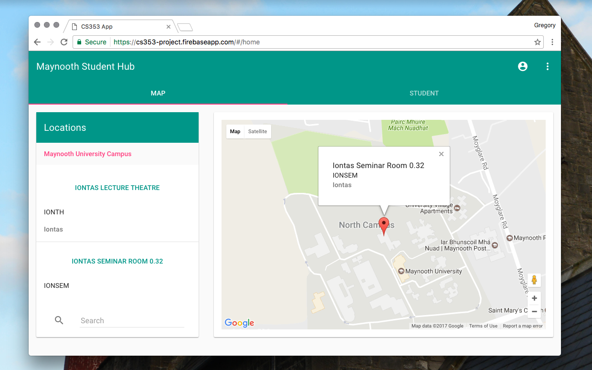

# Description

MuHub is an online web application centred around students studying at Maynooth University, Ireland.

This repository contains the entire codebase for the application. Originally it had been the private upstream repository during the development process. Finally finished, it has been released here to showcase the application.

You can read more about the application on my blog [here](http://www.gregorykelleher.com/blog/angularjs_project) and [here](http://gregorykelleher.com/blog/angularjs_project_2).

The functioning application can be viewed online [here](https://cs353-project.firebaseapp.com/).
